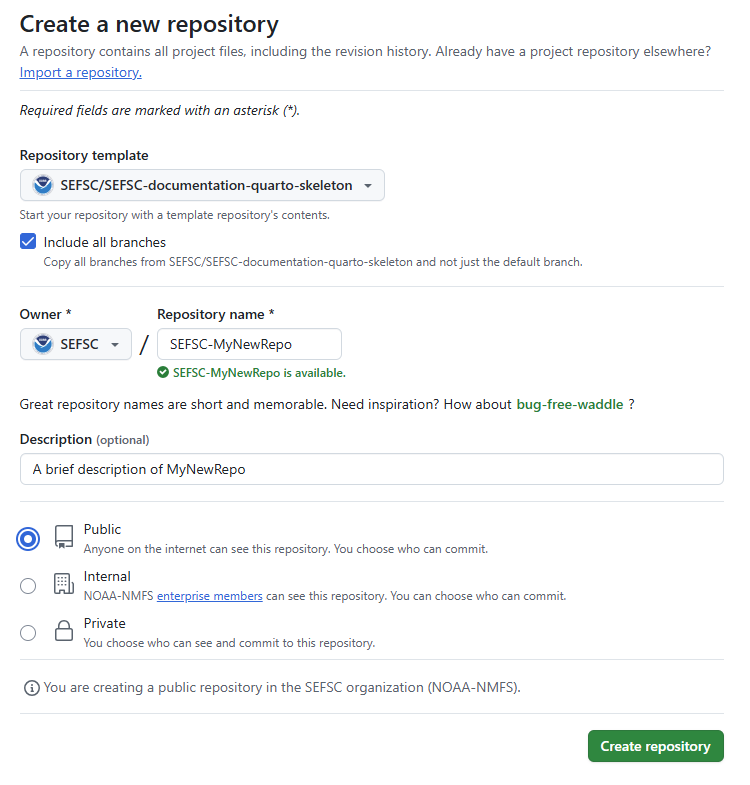
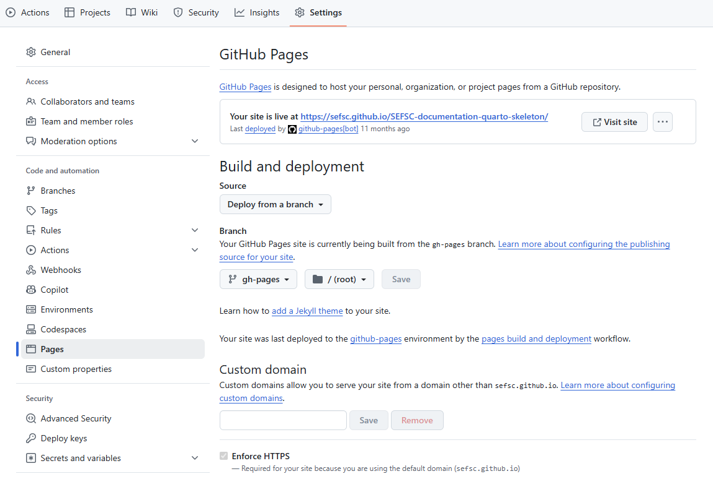

Follow [Step 1a](#step-1a-use-the-sefsc-documentation-quarto-skeleton-template-to-create-your-own-forked-repository) below if you do not yet have a GitHub repository and would like to start a new one with gh-pages. If you already have a repository to which you would like to add a new gh-pages branch with the SEFSC documentation template, start with [Step 1b](#step-1b-add-a-new-orphan-branch-to-an-existing-repository).

### Step 1a: Use the SEFSC-documentation-quarto-skeleton template to create your own forked repository

This is done on the GitHub website.  These steps assume you already have a GitHub account in place.

1. Browse to the [SEFSC-documentation-quarto-skeleton](../..index.qmd) repository, select the "Use this template" button, and select "Create a new repository": 

2. Select the repository owner (your own account or a GitHub organization you have write permissions to) and type a name for the repository. If the new repository is for SEFSC-related work, the repository name should adhere to the SEFSC repository naming convention as depicted in the [SEFSC GitHub SOP](https://github.com/SEFSC/SEFSC-Resources/blob/18a6c7e98b3e9b71f5e5912282d9d7f08c0e0a1a/SEFSC%20GitHub%20SOP%20and%20User%20Agreement%20Form/SEFSC%20Github%20SOP%20-%20RR%20-%20LON%20-%20BGM.pdf). Select the "Include all branches" box. This is important to ensure everything works without any additional manual configuration. Enter a description, if desired. (This can be changed or added later.) Select "Public" (GitHub Pages doesn't work on private repos unless you have a paid account). At the end of this step, you should have a new repository available at the following URL: https://github.com/owner/my-new-documentation-repo.

   

3. In the newly created template repo, click "Settings" at the top of the page, then select "Pages" on the side menu. Enable GitHub Pages, if not already enabled, and note the URL at which the site is live. You can verify that everything worked by navigating to the site in a web browser. It should exactly like the [original web book](https://nmfs-opensci.github.io/NOAA-quarto-simple-python/). Keep other settings unchanged and save any changes.

     

4. From your new repository page, download or "clone" the repository to edit it locally using code editing software such as [Visual Studio Code](https://code.visualstudio.com/). The local editing process assumes you have a git client installed in order to push your edited files back to GitHub.  For those who do not have git, editing can be accomplished on the GitHub website one file at a time (see [Step 2: Edit your documentation site content](#step-2-edit-your-documentation-site-content) below for details). 

   

### Step 1b: Add SEFSC-documentation-quarto-skeleton to an existing repository

This is slightly more involved, but the overall workflow is as follows: We will create two new orphan branches in the existing repository, a `gh-pages` branch from which to deploy the site, and a `docs` branch to house the website files. (An *orphan branch* in GitHub is a branch whose commit history is independent of all other branches in the repo. This is useful for GitHub Pages because we can keep the website files separate from any project code and can work on either the website or the project code independently from each other.) We will then clone the `docs` branch only from the [SEFSC-documentation-quarto]() repo, activate GitHub Pages, and push the new branches to the remote repo.

1. Navigate to your local copy of the repository.

2. [Create a new `gh-pages` orphan branch](https://stackoverflow.com/questions/34100048/create-empty-branch-on-github) and remove the git commit history that is automatically generated.

   ```bash
   git switch --orphan gh-pages
   git rm -rf .
   rm .gitignore
   ```
  
   :::{.callout-note}
   There may or may not be a `.gitignore` file to delete. If not, do not worry.
   :::

3. Commit and push the new branch to the remote repo:

   ```bash
   git commit --allow-empty -m "Initial commit on new orphan branch"
   git push origin gh-pages
   ```

4. Now create a new `docs` branch to house the documentation files. We'll create this as an orphan branch as well because its commit history is independent of any other branch in the repo.

   ```bash
   git switch --orphan docs
   ```

5. We need to temporarily set the remote origin to the SEFSC documentation repo. First, note the existing remote origin URL so that we can restore it later. It can be retrieved with the command:

   ```bash
   git remote -v
   ```
  
   Then change the remote URL to the documentation repo:

   ```bash
   git remote set-url origin https://github.com/SEFSC/SEFSC-documentation-quarto-skeleton.git
   ```
   
   :::{.callout-note}
   To find this new URL, navigate to the [SEFSC-documentation-quarto-skeleton](){target="_blank" rel="noopener"} repo in a web browser and click on the green "< > Code" button.
   :::

6. Make sure you're on your *local* `doc` branch and then pull the contents of the `docs` branch of *SEFSC-documentation-quarto-skeleton* repo:

   ```bash
   git checkout docs
   git pull origin docs
   ```
   
   Use `ls -la` to verify that you now have all of the files and directories from the skeleton repo.

7. Change the local remote origin back to the original repo

   ```bash
   git remote set-url origin <old-url>
   ```
   
   where `<old-url>` is the URL of the original repo retrieved in [Step 1b](#step-1b-add-a-new-orphan-branch-to-an-existing-repository).3.

8. In a web browser, navigate to the repo to which you just added the `gh-pages` and `docs` branches. Click the "Settings" tab, then "Pages" on left sidebar.

9. In the "Build and deployment" section, under "Source", select "Deploy from branch" from the dropdown menu. 

   :::{.callout-note}
   If your repo belongs to you (as opposed to belonging to an organization), it must be a public repo for this be available.
   :::

10. Under "Branch", select "gh-pages" from the dropdown menu. Leave the directory as "/(root)" and click "Save".

   

11. While still within "Settings", click "Actions" on the left sidebar, then "General".

12. Under "Workflow permissions", select "Read and write permissions" to allow GitHub Actions to modify the repository, then click "Save".

    

13. At the top of this page, you should see a banner saying "Your site is now live at..." with the URL of your documentation page. Note this URL.

14. Back on your local computer, push the new `docs` branch to the remote repo:

    ```bash
    git push origin docs
    ```
   
15. Allow a couple minutes for website to build and then launch the URL from the previous step to be sure. It should look exactly like the [SEFSC-documentation-quarto-skeleton page](https://sefsc.github.io/SEFSC-documentation-quarto-skeleton/) but with a URL pointing to your project.
   
    :::{.callout-note}
    GitHub Pages can take a few minutes to build and deploy, depending on how many pages need to be created. This is done automatically using GitHub Actions when changes are pushed to the `docs` branch. On the repo landing page, switch to the `docs` branch. The header of the panel displaying the contents of the repo contains your GitHub username followed by the most recent commit message. A green check mark will appear next to these when the GitHub Actions have run successfully, indicating the page is ready to be viewed. A brown dot will appear while the scripts are running, and a red "X" indicates the scripts failed. You can click on any of these symbols to view the execution log.
    :::

You should now have at least three local branches: the `gh-pages` and `docs` branches you just created, and whatever branch(es) you had originally (*e.g.*,`main`, `master`, *etc.*). Verify using `git branch --all`. Likewise, your remote repository should now have new `gh-pages` and `docs` branches as well as the original branches, and they should contain a copy of the SEFSC documentation template files and subdirectories.

Use `git checkout <branch-name>` to switch between branches. Everything that follows involves this new `docs` branch.
